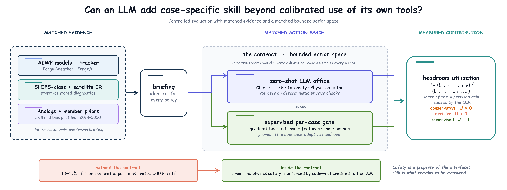
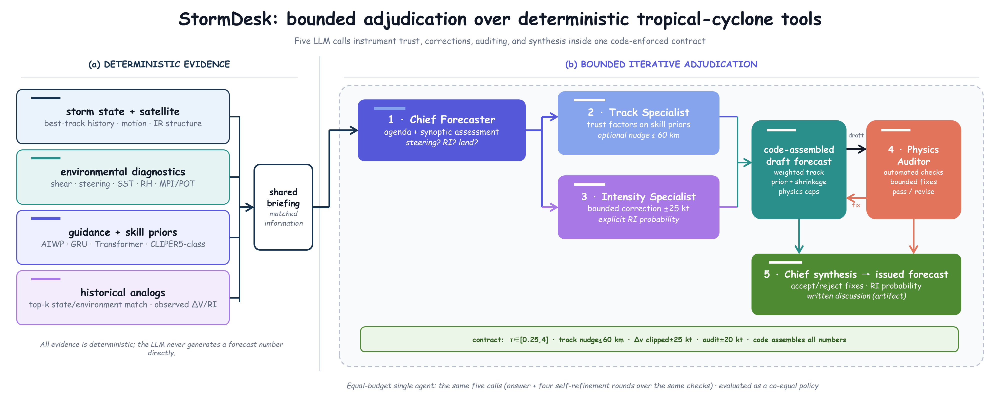
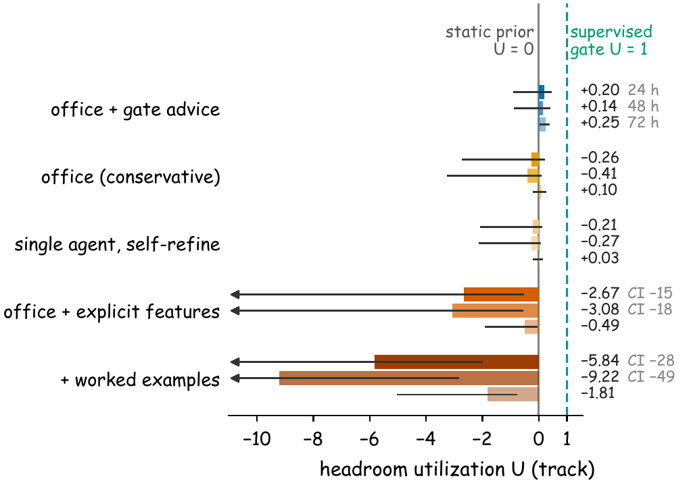
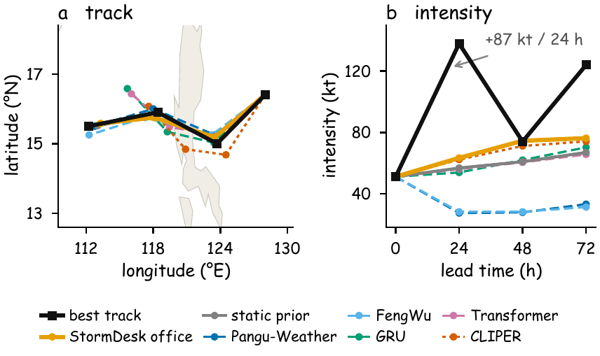

# StormDesk

StormDesk is a virtual tropical cyclone forecast office run by LLM agents, built
to answer one question under controlled conditions:

> Given the same evidence and the same bounded action space, can a zero-shot LLM
> combine forecast guidance as well as a learned decision policy?

Deterministic tools compute a briefing for every forecast cycle. Every policy,
LLM or not, reads that same briefing and acts through the same bounded contract.
A ladder of static, regime-conditioned and supervised reference policies then
pins down what kind of skill each gain actually represents.



## The office

The office makes five LLM calls per cycle: a chief forecaster sets the agenda, a
track specialist adjusts member trust weights, an intensity specialist proposes
bounded corrections, a physics auditor reviews the draft, and the chief issues
the final forecast with a written discussion. Every number is assembled by code;
the agents only act inside the contract.



## Findings

Evaluated on 1,433 forecast cycles over 180 storms from the 2021–2022 seasons,
against 35 policies on one frozen homogeneous sample:

**Safety comes from the contract.** Asked for coordinates directly, the LLM
drops hemisphere signs and 43–45% of its positions land more than 2,000 km off
track. Inside the contract, the office is statistically equivalent to the
static prior at every lead time.

**Case adaptation comes from supervision.** A gradient-boosted gate proves that
real headroom exists inside the same bounds. The office realizes essentially
none of it, and when handed the gate's own features with a prompt that licenses
decisive reweighting, it becomes clearly worse than its conservative self.



The pattern repeats at every stage we instrumented: logistic regression beats
the office's rapid intensification probabilities, a small learned auditor beats
the LLM auditor, and the office degrades a stronger intensity prior when handed
one. The paper reports this as a controlled negative result.

## What is in this repository

Everything needed to replay the analysis, without any GPU:

```
stormdesk/            the package
  agents/prompts.py   the exact office prompts, verbatim
  agents/office.py    the five-call office and every policy variant
  evaluate.py         homogeneous verification, bootstrap, TOST, Holm
scripts/              numbered pipeline stages 00–32
server/               vLLM launch and cluster sync helpers
paper/                figure and table generators
runtime/              released artifacts
  cases/              forecast cycle tables per split
  features/           environmental and satellite diagnostics
  guidance/           merged guidance per cycle
  models/             all statistical anchors: skill and bias profiles,
                      shrinkages, Platt scalings, gates, post-processors
  forecasts/          every policy's forecasts (test and calibration)
  transcripts/        full office deliberations for every LLM run
  results/            frozen analysis manifest, metrics, significance,
                      equivalence, headroom and RI verification tables
```

## Replaying the analysis

All means, tests and confidence intervals in the paper are computed on the
frozen manifest in `runtime/results/test_manifest.json`, which lists the exact
case ids per lead time with hashes. Nothing is transcribed by hand.

```bash
export STORMDESK_WORK=$PWD/runtime

# verification on the frozen manifest
python scripts/07_evaluate.py --split test --case-list runtime/results/test_manifest.json

# paper figures and supplementary tables
python paper/figures/make_figs_v2.py
python paper/make_supp_tables.py
```

The released forecasts and transcripts let you skip every GPU stage. Scripts
08–32 reproduce the individual analyses: behavior statistics, RI classifiers,
the learned gate and stack, audit-stage replay, equivalence tests, regime
statics, headroom utilization, and the Llama recalibration.

## Running the office yourself

The full pipeline, from raw data to forecasts:

| Stage | Script | Needs |
|---|---|---|
| Case tables per split | `00_build_cases.py` | IBTrACS |
| Diagnostics | `01_extract_features.py` | ERA5, GridSat-B1 crops |
| AIWP guidance | `02_run_aiwp.py` | Pangu/FengWu weights, ~60 GPU h |
| DL and statistical members | `03`–`05b` | CPU/single GPU |
| The office | `06_run_agent.py` | a vLLM server |
| Verification | `07_evaluate.py` | CPU |

Start the LLM backend with `server/launch_vllm.sh` (Qwen2.5-7B/14B/72B-AWQ or
Llama-3.1-8B) and point `STORMDESK_LLM_URL` at it. Temperature 0 is the
recommended setting for exact replication; run-to-run variance at 0.3 is
quantified in the supplementary material. If you switch model families, refit
the calibration anchors on that family's own calibration run first; the paper
shows that transferred anchors are what break, not the model family.

## Case study

Super Typhoon Noru gained 87 kt in 24 hours while every guidance member and the
static prior forecast slow strengthening. The office flagged the risk in both
of its channels, and the transcript records why:



The full deliberation for this cycle, and for every other cycle, is in
`runtime/transcripts/`.

## Data sources

IBTrACS v04r00 (NOAA), ERA5 (Copernicus/ECMWF), GridSat-B1 (NOAA), and the
public Pangu-Weather, FengWu, Qwen2.5 and Llama-3.1 checkpoints. Raw reanalysis
and satellite archives are not redistributed here; the derived per-cycle inputs
in `runtime/` are.

The accompanying paper is under double-blind review. A preprint link will be
added here after the decision.
